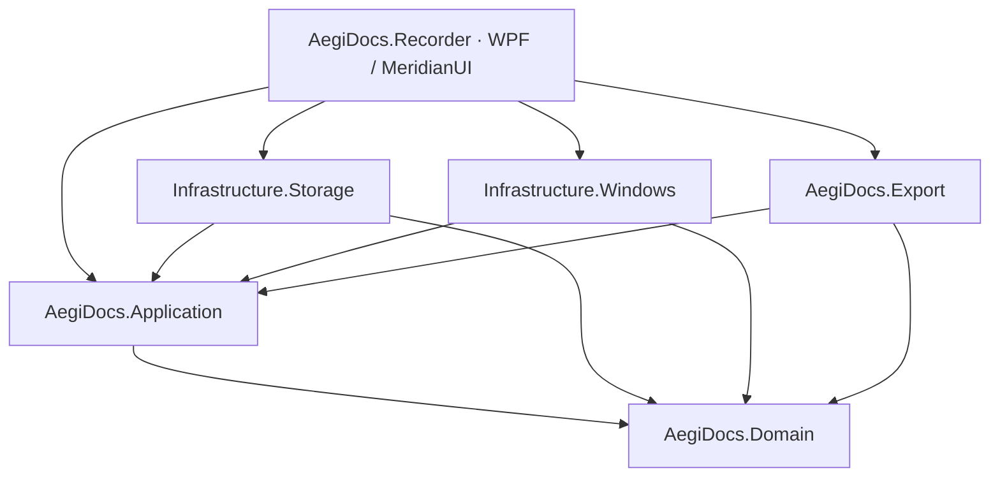

# ADR-0001: Arquitectura modular para el MVP de AegiDocs.Recorder

- **Estado:** Aceptado
- **Fecha:** 2026-08-05
- **Decisores:** Orquestador de AegiDocs
- **Tarea(s) relacionada(s):** `E01-P01-T01`, `E01-P01-T02`, `E01-P01-T03`, `E01-P01-T04`

## Contexto y problema

El proyecto actual contiene una aplicación WPF inicial. El MVP debe combinar un dominio de tutoriales, persistencia local, captura Windows, input global, edición, anotaciones y exportación. Si esas responsabilidades permanecen dentro de la aplicación WPF, las pruebas dependerán de Windows y los futuros agentes competirán por los mismos archivos; además, una vista podría terminar llamando directamente a Win32 o a I/O.

La aplicación procesa capturas potencialmente sensibles. Por ello la política local-first, la cancelación, el ownership de recursos nativos y el control explícito de los límites de datos deben ser visibles en la arquitectura.

## Drivers de decisión

- Mantener Domain puro, determinista y testeable sin Windows, WPF ni sistema de archivos.
- Permitir que Terra implemente paquetes independientes con archivos propietarios.
- Aislar hooks, Windows Graphics Capture, DPI y handles nativos detrás de puertos de Application.
- Conservar un único proceso y despliegue simple para el MVP.
- Mantener MeridianUI exclusivamente en Presentation, sin filtrar tokens o controles WPF a las capas internas.
- Evitar infraestructura, red y proveedores IA dentro de Domain o Presentation.

## Decisión

Se adopta un **monolito modular con proyectos separados**. La solución contendrá los siguientes proyectos de producción:

| Proyecto | Responsabilidad |
| --- | --- |
| `AegiDocs.Domain` | Entidades, value objects, invariantes y reglas de tutoriales. |
| `AegiDocs.Application` | Casos de uso, puertos, resultados tipados, cancelación y coordinación independiente de plataforma. |
| `AegiDocs.Infrastructure.Storage` | DTOs, JSON, assets, autosave, migraciones y recuperación local. |
| `AegiDocs.Infrastructure.Windows` | Input global, hotkeys, ventanas, DPI, captura y recursos nativos de Windows. |
| `AegiDocs.Export` | Representación publicable y exportadores. |
| `AegiDocs.Recorder` | WPF, MeridianUI, MVVM, navegación, composición de dependencias y recursos. |

La composición se realiza únicamente en `AegiDocs.Recorder` (el composition root de `App.xaml.cs` o bootstrapper equivalente). Las implementaciones de infraestructura se registran allí contra interfaces definidas por Application. Las views solo se enlazan a view models y comandos; el code-behind queda limitado a inicialización visual o delegación de comandos.

Las flechas muestran referencias de compilación permitidas. Domain no referencia ningún otro proyecto. Application no referencia infraestructura ni WPF. Infrastructure no se referencia entre sí. Recorder es el único consumidor que conoce implementaciones concretas.

### Reglas de contratos

- Domain usa tipos .NET base y no depende de `System.Windows`, APIs WinRT, P/Invoke, JSON, streams o paquetes de UI.
- Application define puertos como `IProjectRepository`, `IScreenCaptureService`, `IGlobalInputSource`, `IWindowFilter`, `IClock` y `IAppLogger`; sus implementaciones viven fuera.
- Los contratos asíncronos reciben `CancellationToken`; los resultados esperables se modelan como resultados/errores tipados, no excepciones filtradas a la UI.
- Los DTOs persistidos pertenecen a Storage y se traducen hacia/desde Domain/Application. El esquema JSON no se expone como entidad de dominio.
- Application orquesta la lógica; Infrastructure.Windows no crea pasos ni modifica view models desde callbacks nativos.
- Export recibe una representación publicable o Domain/Application, nunca controles WPF, brushes MeridianUI ni ventanas.
- Recorder consume tokens MeridianUI y patrones WPF solo en Resources, Views y ViewModels. La decisión de tema de documentos se traduce desde tokens, no comparte `System.Windows.Media` con Export.

## Alcance

- Crear los seis proyectos indicados y proyectos de pruebas por capa.
- Definir el grafo de referencias y tests que lo protejan.
- Mover la aplicación WPF existente al rol de Presentation/composición sin cambiar su comportamiento visual.
- Usar DI para sustituir infraestructura por fakes en pruebas y diseño de UI.

## No alcance

- Separar procesos, crear microservicios o introducir comunicación de red.
- Plugin system, proveedor de IA, OCR, sincronización en nube o telemetría.
- Decidir el formato físico `.aegidocs`, el motor PDF o el mecanismo de empaquetado.
- Adoptar MaterialDesignInXaml u otro paquete UI antes de que exista un ADR e inventario de licencia.

## Alternativas consideradas y trade-offs

| Alternativa | Ventajas | Desventajas y riesgos | Decisión |
| --- | --- | --- | --- |
| Monolito modular con proyectos separados | Límites compilables, pruebas aisladas, paralelismo por proyecto y despliegue simple. | Más proyectos y referencias iniciales; requiere disciplina de composición. | Aceptada. |
| Mantener un único proyecto WPF con carpetas | Inicio rápido y pocos archivos de solución. | Límites solo convencionales; WPF/Win32 se filtra al dominio y agentes chocan con más frecuencia. | Descartada. |
| Vertical slices dentro de WPF con infraestructura junto a views | Feature-local y rápido para prototipos. | Duplica integración, dificulta tests y rompe separación de datos sensibles/recursos nativos. | Descartada. |
| Servicios/procesos independientes | Aislamiento fuerte de captura y futuras integraciones. | IPC, instalación, seguridad y diagnóstico exceden el MVP. | Diferida. |

## Consecuencias

### Positivas

- Domain y Application pueden tener pruebas unitarias rápidas y deterministas.
- Win32/WGC se encapsulan y pueden fallar sin romper directamente la UI.
- Storage, Windows y Export se pueden implementar en paralelo después de congelar puertos.
- El código de presentación puede usar MeridianUI sin contaminar outputs ni contratos.

### Negativas y deuda aceptada

- El scaffolding y las referencias de solución ocurren antes de construir funcionalidad visible.
- El composition root tendrá múltiples registros y debe mantenerse explícito.
- Algunos contratos iniciales podrán evolucionar; cambios se harán mediante ADR y pruebas de contrato, no con referencias directas.

## Seguridad y privacidad

Las capturas y sus metadatos permanecen locales. Infrastructure.Windows solo entrega información mínima requerida por los puertos; no envía ni registra contenido. Storage valida rutas y datos no confiables. El futuro adaptador IA solo podrá ser una implementación explícita de un puerto de Application, con consentimiento y secretos fuera del repositorio.

- ¿Introduce tráfico de red, telemetría, secretos o servicios externos? **No.**
- ¿Puede incluir PII, credenciales, texto sensible o capturas? **Sí.** Se restringe a Domain/Storage/Windows bajo la política local-first; Presentation debe comunicar el estado y Export debe aplanar redacciones.
- ¿Requiere validación de entradas no confiables, permisos Windows o aislamiento adicional? **Sí.** Storage y Windows son responsables de sus validaciones tras puertos definidos por Application.

## Impacto en MeridianUI y accesibilidad

MeridianUI se limita a Recorder. Todas las views nuevas usan `Resources/MeridianTokens.xaml`, MVVM y las reglas de `AGENTS.md`. Los view models exponen estados semánticos de loading, empty, error, success, disabled, selected y active sin exponer brushes/controles. Export traduce una semántica de tema independiente; no depende de recursos WPF.

## Plan de implementación o migración

1. Crear proyectos de producción y pruebas vacíos, configurar referencias y mantener `AegiDocs.Recorder` como startup project.
2. Añadir tests de arquitectura que impidan dependencias prohibidas.
3. Mover solo recursos WPF existentes dentro de Recorder; no extraer código funcional inexistente.
4. Añadir contratos transversales en Application y fakes en proyectos de prueba.
5. Implementar Domain antes de Storage, Windows o Export; después conectar adaptadores mediante DI.

No hay datos existentes que migrar. `AegiDocs.Recorder` continuará iniciando con la misma ventana hasta que los view models sustituyan el placeholder.

## Validación

- La solución compila con el grafo de referencias definido y sin ciclos.
- Tests de arquitectura prueban que Domain no referencia WPF/Win32 y Application no referencia Infrastructure.
- Tests unitarios pueden usar fakes para todos los puertos de Windows/Storage.
- `dotnet format AegiDocs.slnx --verify-no-changes`, `dotnet build AegiDocs.slnx --configuration Release` y `dotnet test AegiDocs.slnx --configuration Release --no-build` pasan.

## Rollback

Si el scaffolding revela una restricción del SDK que impide un proyecto independiente, se revierte únicamente el proyecto/adaptador afectado y se conserva el contrato en Application. No se permite volver a acoplar la infraestructura a WPF: se crea un ADR de reemplazo con evidencia del bloqueo y una ruta alternativa de aislamiento.

## Enlaces relacionados

- [Arquitectura objetivo](../Architecture.md)
- [Plan maestro](../Implementation-Plan.md)
- [Registro de riesgos](../Risk-Register.md)
- [Plantilla ADR](0000-template.md)
